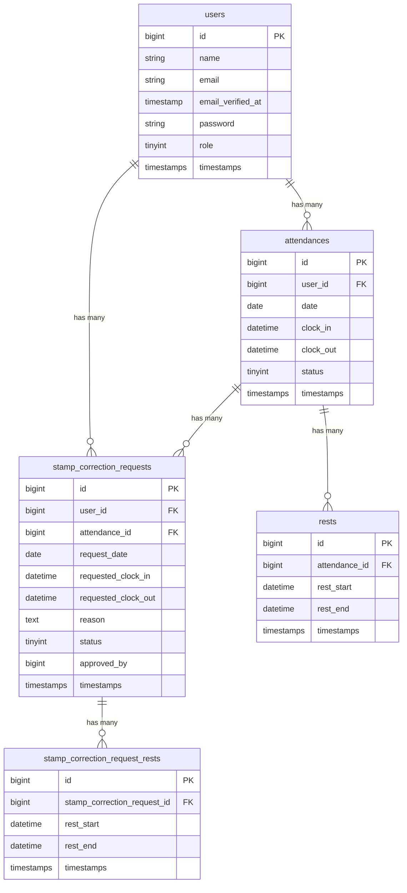

# coachtech 勤怠管理アプリ

## 概要

企業向けの勤怠管理Webアプリケーションです。従業員の出退勤打刻、休憩管理、勤怠一覧の確認、勤怠修正申請が可能です。管理者は全従業員の勤怠情報の閲覧・編集、修正申請の承認、CSV出力ができます。

Laravel Fortifyによる認証基盤を採用し、メール認証（MailHog）にも対応しています。

## 環境構築

```bash
git clone git@github.com:mattyopon/attendance-app.git
cd attendance-app
docker compose up -d --build
docker compose exec app composer install
docker compose exec app cp .env.example .env
docker compose exec app php artisan key:generate
docker compose exec app php artisan migrate
docker compose exec app php artisan db:seed
```

※ `docker compose exec` でエラーが発生する場合は、コンテナ名を直接指定してください:

```bash
docker exec attendance-app composer install
docker exec attendance-app cp .env.example .env
docker exec attendance-app php artisan key:generate
docker exec attendance-app php artisan migrate
docker exec attendance-app php artisan db:seed
```

## 使用技術一覧

| 技術 | バージョン |
|------|-----------|
| PHP | 8.2 |
| Laravel | 11.x |
| MySQL | 8.0 |
| Nginx | 1.24 |
| Docker / Docker Compose | - |
| Laravel Fortify | 1.x |
| MailHog | - |

## ER図



## URL一覧

### 一般ユーザー

| 画面 | URL |
|------|-----|
| 会員登録 | /register |
| ログイン | /login |
| 勤怠打刻 | /attendance |
| 勤怠一覧 | /attendance/list |
| 勤怠詳細 | /attendance/{id} |
| 申請一覧 | /stamp_correction_request/list |

### 管理者

| 画面 | URL |
|------|-----|
| 管理者ログイン | /admin/login |
| 管理者勤怠一覧 | /admin/attendance/list |
| 管理者勤怠詳細 | /admin/attendance/{id} |
| スタッフ一覧 | /admin/staff/list |
| スタッフ別勤怠 | /admin/staff/{id}/attendance |
| 管理者申請一覧 | /admin/stamp_correction_request/list |
| 修正申請承認 | /admin/stamp_correction_request/{id}/approve |

## アカウント情報

シーダーで作成される初期アカウントは以下の通りです。

### 管理者

| 名前 | メールアドレス | パスワード |
|------|---------------|-----------|
| 管理者 | admin@example.com | password |

### 一般ユーザー

| 名前 | メールアドレス | パスワード |
|------|---------------|-----------|
| 山田太郎 | user1@example.com | password |
| 鈴木花子 | user2@example.com | password |
| 佐藤次郎 | user3@example.com | password |
| 田中美咲 | user4@example.com | password |
| 高橋健太 | user5@example.com | password |

## テスト実行方法

```bash
docker compose exec app php artisan test
```

## MailHog（メール確認用）

開発環境では MailHog を使用してメール送信を確認できます。

- URL: [http://localhost:8025](http://localhost:8025)
- SMTP ポート: 1025

会員登録後のメール認証メールなどが MailHog の Web UI で確認できます。
