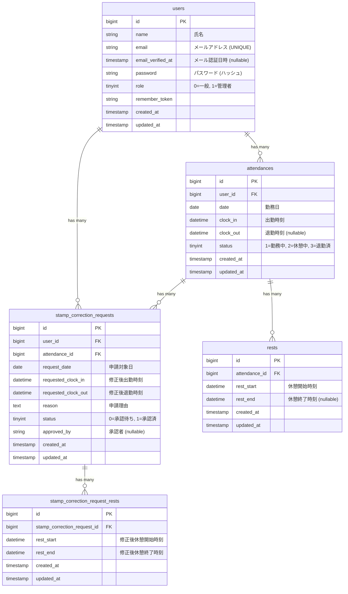

# 勤怠管理アプリ 技術設計書

## 技術スタック

| 項目 | 技術 | バージョン |
|------|------|-----------|
| 言語 | PHP | 8.2 |
| フレームワーク | Laravel | 11.x |
| DB | MySQL | 8.0 |
| 認証 | Laravel Fortify | 1.x |
| テンプレート | Blade | - |
| CSS | カスタムCSS | - |
| テスト | PHPUnit | 10.x |
| コンテナ | Docker / Docker Compose | - |
| メール | MailHog | - |
| Webサーバー | Nginx | 1.25 |

---

## 1. ディレクトリ構成

```
attendance-app/
├── docker/
│   ├── php/
│   │   ├── Dockerfile
│   │   └── php.ini
│   └── nginx/
│       └── default.conf
├── src/                          # Laravelプロジェクトルート
│   ├── app/
│   │   ├── Http/
│   │   │   ├── Controllers/
│   │   │   │   ├── Auth/
│   │   │   │   │   └── (Fortify用カスタムコントローラー)
│   │   │   │   ├── AttendanceController.php
│   │   │   │   ├── RestController.php
│   │   │   │   ├── StampCorrectionRequestController.php
│   │   │   │   └── Admin/
│   │   │   │       ├── AdminAttendanceController.php
│   │   │   │       ├── AdminStaffController.php
│   │   │   │       └── AdminStampCorrectionRequestController.php
│   │   │   ├── Middleware/
│   │   │   │   ├── AdminMiddleware.php
│   │   │   │   └── UserMiddleware.php
│   │   │   └── Requests/
│   │   │       ├── LoginRequest.php
│   │   │       ├── RegisterRequest.php
│   │   │       ├── ClockInRequest.php
│   │   │       ├── ClockOutRequest.php
│   │   │       ├── RestStartRequest.php
│   │   │       ├── RestEndRequest.php
│   │   │       └── StampCorrectionFormRequest.php
│   │   ├── Models/
│   │   │   ├── User.php
│   │   │   ├── Attendance.php
│   │   │   ├── Rest.php
│   │   │   ├── StampCorrectionRequest.php
│   │   │   └── StampCorrectionRequestRest.php
│   │   ├── Providers/
│   │   │   ├── AppServiceProvider.php
│   │   │   └── FortifyServiceProvider.php
│   │   └── Actions/
│   │       └── Fortify/
│   │           ├── CreateNewUser.php
│   │           └── (その他Fortifyアクション)
│   ├── config/
│   │   └── fortify.php
│   ├── database/
│   │   ├── migrations/
│   │   │   ├── xxxx_create_users_table.php
│   │   │   ├── xxxx_create_attendances_table.php
│   │   │   ├── xxxx_create_rests_table.php
│   │   │   ├── xxxx_create_stamp_correction_requests_table.php
│   │   │   ├── xxxx_create_stamp_correction_request_rests_table.php
│   │   │   └── xxxx_create_sessions_table.php
│   │   ├── seeders/
│   │   │   ├── DatabaseSeeder.php
│   │   │   ├── UserSeeder.php
│   │   │   ├── AttendanceSeeder.php
│   │   │   └── RestSeeder.php
│   │   └── factories/
│   │       ├── UserFactory.php
│   │       ├── AttendanceFactory.php
│   │       └── RestFactory.php
│   ├── resources/
│   │   └── views/
│   │       ├── layouts/
│   │       │   ├── app.blade.php          # 一般ユーザー用レイアウト
│   │       │   └── admin.blade.php        # 管理者用レイアウト
│   │       ├── auth/
│   │       │   ├── login.blade.php
│   │       │   ├── register.blade.php
│   │       │   └── admin-login.blade.php
│   │       ├── attendance/
│   │       │   ├── index.blade.php        # 勤怠打刻画面
│   │       │   ├── list.blade.php         # 勤怠一覧画面
│   │       │   └── show.blade.php         # 勤怠詳細画面
│   │       ├── stamp_correction/
│   │       │   └── list.blade.php         # 申請一覧画面
│   │       └── admin/
│   │           ├── attendance/
│   │           │   ├── list.blade.php     # 管理者勤怠一覧
│   │           │   └── show.blade.php     # 管理者勤怠詳細
│   │           ├── staff/
│   │           │   ├── list.blade.php     # スタッフ一覧
│   │           │   └── attendance_list.blade.php  # スタッフ別勤怠一覧
│   │           └── stamp_correction/
│   │               └── list.blade.php     # 管理者申請一覧
│   ├── routes/
│   │   └── web.php
│   └── tests/
│       └── Feature/
│           ├── Auth/
│           │   ├── RegisterTest.php
│           │   ├── LoginTest.php
│           │   └── AdminLoginTest.php
│           ├── Attendance/
│           │   ├── ClockInTest.php
│           │   ├── ClockOutTest.php
│           │   ├── AttendanceListTest.php
│           │   └── AttendanceDetailTest.php
│           ├── Rest/
│           │   └── RestTest.php
│           ├── StampCorrection/
│           │   └── StampCorrectionRequestTest.php
│           └── Admin/
│               ├── AdminAttendanceTest.php
│               ├── AdminStaffTest.php
│               └── AdminStampCorrectionTest.php
├── docker-compose.yml
└── docs/
    └── design/
        └── technical-design.md
```

---

## 2. DB設計

### ER図



### テーブル定義詳細

#### users テーブル
| カラム名 | 型 | 制約 | 説明 |
|---------|-----|------|------|
| id | BIGINT UNSIGNED | PK, AUTO_INCREMENT | |
| name | VARCHAR(255) | NOT NULL | 氏名 |
| email | VARCHAR(255) | NOT NULL, UNIQUE | メールアドレス |
| email_verified_at | TIMESTAMP | NULLABLE | メール認証日時 |
| password | VARCHAR(255) | NOT NULL | ハッシュ化パスワード |
| role | TINYINT UNSIGNED | NOT NULL, DEFAULT 0 | 0=一般ユーザー, 1=管理者 |
| remember_token | VARCHAR(100) | NULLABLE | |
| created_at | TIMESTAMP | NULLABLE | |
| updated_at | TIMESTAMP | NULLABLE | |

#### attendances テーブル
| カラム名 | 型 | 制約 | 説明 |
|---------|-----|------|------|
| id | BIGINT UNSIGNED | PK, AUTO_INCREMENT | |
| user_id | BIGINT UNSIGNED | FK(users.id), NOT NULL | |
| date | DATE | NOT NULL | 勤務日 |
| clock_in | DATETIME | NOT NULL | 出勤時刻 |
| clock_out | DATETIME | NULLABLE | 退勤時刻 |
| status | TINYINT UNSIGNED | NOT NULL, DEFAULT 1 | 1=勤務中, 2=休憩中, 3=退勤済 |
| created_at | TIMESTAMP | NULLABLE | |
| updated_at | TIMESTAMP | NULLABLE | |

**インデックス:** `(user_id, date)` に複合インデックス（ユニーク）

#### rests テーブル
| カラム名 | 型 | 制約 | 説明 |
|---------|-----|------|------|
| id | BIGINT UNSIGNED | PK, AUTO_INCREMENT | |
| attendance_id | BIGINT UNSIGNED | FK(attendances.id), NOT NULL | |
| rest_start | DATETIME | NOT NULL | 休憩開始 |
| rest_end | DATETIME | NULLABLE | 休憩終了 |
| created_at | TIMESTAMP | NULLABLE | |
| updated_at | TIMESTAMP | NULLABLE | |

#### stamp_correction_requests テーブル
| カラム名 | 型 | 制約 | 説明 |
|---------|-----|------|------|
| id | BIGINT UNSIGNED | PK, AUTO_INCREMENT | |
| user_id | BIGINT UNSIGNED | FK(users.id), NOT NULL | |
| attendance_id | BIGINT UNSIGNED | FK(attendances.id), NOT NULL | |
| request_date | DATE | NOT NULL | 申請対象日 |
| requested_clock_in | DATETIME | NOT NULL | 修正後出勤時刻 |
| requested_clock_out | DATETIME | NOT NULL | 修正後退勤時刻 |
| reason | TEXT | NOT NULL | 申請理由 |
| status | TINYINT UNSIGNED | NOT NULL, DEFAULT 0 | 0=承認待ち, 1=承認済 |
| approved_by | BIGINT UNSIGNED | NULLABLE, FK(users.id) | 承認した管理者のID |
| created_at | TIMESTAMP | NULLABLE | |
| updated_at | TIMESTAMP | NULLABLE | |

#### stamp_correction_request_rests テーブル
修正申請時の休憩時間修正データを保持する。1つの修正申請に対して複数の休憩修正を持てる。

| カラム名 | 型 | 制約 | 説明 |
|---------|-----|------|------|
| id | BIGINT UNSIGNED | PK, AUTO_INCREMENT | |
| stamp_correction_request_id | BIGINT UNSIGNED | FK(stamp_correction_requests.id), NOT NULL | |
| rest_start | DATETIME | NOT NULL | 修正後休憩開始時刻 |
| rest_end | DATETIME | NOT NULL | 修正後休憩終了時刻 |
| created_at | TIMESTAMP | NULLABLE | |
| updated_at | TIMESTAMP | NULLABLE | |

---

## 3. 認証設計

### Fortify設定方針

Laravel Fortifyを認証バックエンドとして使用し、ビューは自前のBladeテンプレートで実装する。

#### config/fortify.php の主要設定

```php
'features' => [
    Features::registration(),
    Features::emailVerification(),  // 応用: メール認証
],

'views' => true,  // ビューの自動登録を有効化
```

#### FortifyServiceProvider でのビューカスタマイズ

```php
// FortifyServiceProvider::boot()

Fortify::loginView(function () {
    return view('auth.login');
});

Fortify::registerView(function () {
    return view('auth.register');
});
```

### 一般ユーザーと管理者の認証分離

**方式: 単一ガード + roleベースミドルウェア**

管理者と一般ユーザーは同じ `users` テーブルを使い、`role` カラムで区別する。Laravelのデフォルト `web` ガードを使用し、カスタムミドルウェアでアクセス制御を行う。

**理由:**
- ガード分離は複雑性が高く、このアプリの規模では過剰
- roleベースの方がシンプルで保守しやすい
- 管理者用のログイン画面は別URLで用意するが、認証処理自体は共通

#### AdminMiddleware

```php
class AdminMiddleware
{
    public function handle(Request $request, Closure $next)
    {
        if (!auth()->check() || auth()->user()->role !== 1) {
            return redirect('/login');
        }
        return $next($request);
    }
}
```

#### 管理者ログイン

管理者ログイン画面 (`/admin/login`) を別途用意する。Fortifyのデフォルトログインとは別に、AdminAuthControllerでログイン処理を実装し、ログイン成功後は管理者画面にリダイレクトする。

### メール認証設計（応用）

- Fortifyの `emailVerification` featureを有効化
- Userモデルに `MustVerifyEmail` インターフェースを実装
- MailHogをローカルSMTPサーバーとして使用
- `.env` のメール設定:

```env
MAIL_MAILER=smtp
MAIL_HOST=mailhog
MAIL_PORT=1025
MAIL_USERNAME=null
MAIL_PASSWORD=null
MAIL_ENCRYPTION=null
MAIL_FROM_ADDRESS="noreply@attendance-app.local"
MAIL_FROM_NAME="勤怠管理アプリ"
```

- `EnsureEmailIsVerified` ミドルウェアを認証が必要なルートに適用
- 一般ユーザーのみメール認証必須。管理者はシーダーで `email_verified_at` をセット済みとする

---

## 4. ルーティング設計

```php
// routes/web.php

use App\Http\Controllers\AttendanceController;
use App\Http\Controllers\RestController;
use App\Http\Controllers\StampCorrectionRequestController;
use App\Http\Controllers\Admin\AdminAttendanceController;
use App\Http\Controllers\Admin\AdminStaffController;
use App\Http\Controllers\Admin\AdminStampCorrectionRequestController;

// ====================
// 認証関連（Fortify が自動登録）
// ====================
// GET  /register          - 会員登録画面
// POST /register          - 会員登録処理
// GET  /login             - ログイン画面
// POST /login             - ログイン処理
// POST /logout            - ログアウト
// GET  /email/verify      - メール認証待ち画面
// GET  /email/verify/{id}/{hash} - メール認証処理

// ====================
// 管理者ログイン
// ====================
Route::get('/admin/login', [AdminAuthController::class, 'showLogin'])
    ->name('admin.login');
Route::post('/admin/login', [AdminAuthController::class, 'login']);

// ====================
// 一般ユーザー（認証 + メール認証済み）
// ====================
Route::middleware(['auth', 'verified'])->group(function () {

    // 勤怠打刻画面（トップ画面）
    // GET /attendance
    Route::get('/attendance', [AttendanceController::class, 'index'])
        ->name('attendance.index');

    // 出勤打刻
    // POST /attendance/clock-in
    Route::post('/attendance/clock-in', [AttendanceController::class, 'clockIn'])
        ->name('attendance.clockIn');

    // 退勤打刻
    // POST /attendance/clock-out
    Route::post('/attendance/clock-out', [AttendanceController::class, 'clockOut'])
        ->name('attendance.clockOut');

    // 休憩開始
    // POST /attendance/rest-start
    Route::post('/attendance/rest-start', [RestController::class, 'start'])
        ->name('rest.start');

    // 休憩終了
    // POST /attendance/rest-end
    Route::post('/attendance/rest-end', [RestController::class, 'end'])
        ->name('rest.end');

    // 勤怠一覧画面
    // GET /attendance/list
    Route::get('/attendance/list', [AttendanceController::class, 'list'])
        ->name('attendance.list');

    // 勤怠詳細画面
    // GET /attendance/{id}
    Route::get('/attendance/{id}', [AttendanceController::class, 'show'])
        ->name('attendance.show');

    // 修正申請
    // POST /attendance/{id}/correction
    Route::post('/attendance/{id}/correction', [StampCorrectionRequestController::class, 'store'])
        ->name('stamp_correction.store');

    // 申請一覧画面
    // GET /stamp_correction_request/list
    Route::get('/stamp_correction_request/list', [StampCorrectionRequestController::class, 'list'])
        ->name('stamp_correction.list');
});

// ====================
// 管理者（認証 + 管理者権限）
// ====================
Route::middleware(['auth', 'admin'])->prefix('admin')->group(function () {

    // 勤怠一覧画面（日付別全スタッフ）
    // GET /admin/attendance/list
    Route::get('/attendance/list', [AdminAttendanceController::class, 'list'])
        ->name('admin.attendance.list');

    // 勤怠詳細画面
    // GET /admin/attendance/{id}
    Route::get('/attendance/{id}', [AdminAttendanceController::class, 'show'])
        ->name('admin.attendance.show');

    // 勤怠修正（管理者による直接修正）
    // PUT /admin/attendance/{id}
    Route::put('/attendance/{id}', [AdminAttendanceController::class, 'update'])
        ->name('admin.attendance.update');

    // スタッフ一覧画面
    // GET /admin/staff/list
    Route::get('/staff/list', [AdminStaffController::class, 'list'])
        ->name('admin.staff.list');

    // スタッフ別勤怠一覧
    // GET /admin/staff/{id}/attendance
    Route::get('/staff/{id}/attendance', [AdminStaffController::class, 'attendanceList'])
        ->name('admin.staff.attendance');

    // 修正申請一覧画面
    // GET /admin/stamp_correction_request/list
    Route::get('/stamp_correction_request/list', [AdminStampCorrectionRequestController::class, 'list'])
        ->name('admin.stamp_correction.list');

    // 修正申請詳細画面
    // GET /admin/stamp_correction_request/{id}/approve
    Route::get('/stamp_correction_request/{id}/approve', [AdminStampCorrectionRequestController::class, 'show'])
        ->name('admin.stamp_correction.show');

    // 修正申請承認
    // PUT /admin/stamp_correction_request/{id}/approve
    Route::put('/stamp_correction_request/{id}/approve', [AdminStampCorrectionRequestController::class, 'approve'])
        ->name('admin.stamp_correction.approve');

    // CSVエクスポート（スタッフ別勤怠）
    // GET /admin/staff/{id}/attendance/export
    Route::get('/staff/{id}/attendance/export', [AdminStaffController::class, 'exportCsv'])
        ->name('admin.staff.attendance.export');
});
```

### 画面一覧とURL対応表

| # | 画面名 | URL | メソッド | コントローラー |
|---|--------|-----|----------|---------------|
| 1 | 会員登録 | /register | GET | Fortify |
| 2 | ログイン | /login | GET | Fortify |
| 3 | 管理者ログイン | /admin/login | GET | AdminAuthController |
| 4 | メール認証待ち | /email/verify | GET | Fortify |
| 5 | 勤怠打刻 | /attendance | GET | AttendanceController@index |
| 6 | 勤怠一覧 | /attendance/list | GET | AttendanceController@list |
| 7 | 勤怠詳細 | /attendance/{id} | GET | AttendanceController@show |
| 8 | 申請一覧 | /stamp_correction_request/list | GET | StampCorrectionRequestController@list |
| 9 | 管理者勤怠一覧 | /admin/attendance/list | GET | AdminAttendanceController@list |
| 10 | 管理者勤怠詳細 | /admin/attendance/{id} | GET | AdminAttendanceController@show |
| 11 | スタッフ一覧 | /admin/staff/list | GET | AdminStaffController@list |
| 12 | スタッフ別勤怠 | /admin/staff/{id}/attendance | GET | AdminStaffController@attendanceList |
| 13 | 管理者申請一覧 | /admin/stamp_correction_request/list | GET | AdminStampCorrectionRequestController@list |
| 14 | 修正申請詳細 | /admin/stamp_correction_request/{id}/approve | GET | AdminStampCorrectionRequestController@show |

---

## 5. コントローラー設計

### AttendanceController
勤怠打刻と勤怠記録の表示を担当。

| メソッド | HTTP | URL | 説明 |
|---------|------|-----|------|
| index() | GET | /attendance | 勤怠打刻画面を表示。現在のステータス（未出勤/勤務中/休憩中/退勤済）を判定して表示 |
| clockIn() | POST | /attendance/clock-in | 出勤打刻。当日の勤怠レコードを作成 |
| clockOut() | POST | /attendance/clock-out | 退勤打刻。clock_outを記録しstatusを退勤済に更新 |
| list() | GET | /attendance/list | 月別の勤怠一覧を表示。月の前後移動に対応 |
| show() | GET | /attendance/{id} | 勤怠詳細画面。修正申請フォームを含む |

### RestController
休憩の開始・終了を担当。

| メソッド | HTTP | URL | 説明 |
|---------|------|-----|------|
| start() | POST | /attendance/rest-start | 休憩開始。restsテーブルにレコード作成、attendance.statusを休憩中に |
| end() | POST | /attendance/rest-end | 休憩終了。rest_endを記録、attendance.statusを勤務中に戻す |

### StampCorrectionRequestController
勤怠修正申請の作成と一覧表示を担当。

| メソッド | HTTP | URL | 説明 |
|---------|------|-----|------|
| store() | POST | /attendance/{id}/correction | 修正申請を作成 |
| list() | GET | /stamp_correction_request/list | 自分の申請一覧を表示（承認待ち/承認済タブ切替） |

### Admin\AdminAuthController
管理者認証を担当。

| メソッド | HTTP | URL | 説明 |
|---------|------|-----|------|
| showLogin() | GET | /admin/login | 管理者ログイン画面を表示 |
| login() | POST | /admin/login | ログイン処理。roleチェック含む |

### Admin\AdminAttendanceController
管理者による勤怠管理を担当。

| メソッド | HTTP | URL | 説明 |
|---------|------|-----|------|
| list() | GET | /admin/attendance/list | 日付別の全スタッフ勤怠一覧。日付の前後移動に対応 |
| show() | GET | /admin/attendance/{id} | 勤怠詳細。修正フォーム付き |
| update() | PUT | /admin/attendance/{id} | 管理者による勤怠データ直接修正 |

### Admin\AdminStaffController
スタッフ管理を担当。

| メソッド | HTTP | URL | 説明 |
|---------|------|-----|------|
| list() | GET | /admin/staff/list | 一般ユーザー一覧を表示 |
| attendanceList() | GET | /admin/staff/{id}/attendance | 指定スタッフの月別勤怠一覧 |
| exportCsv() | GET | /admin/staff/{id}/attendance/export | 指定スタッフの勤怠データをCSVエクスポート |

### Admin\AdminStampCorrectionRequestController
修正申請の管理を担当。

| メソッド | HTTP | URL | 説明 |
|---------|------|-----|------|
| list() | GET | /admin/stamp_correction_request/list | 全ユーザーの修正申請一覧（承認待ち/承認済タブ） |
| show() | GET | /admin/stamp_correction_request/{id}/approve | 修正申請詳細画面（承認前の内容確認） |
| approve() | PUT | /admin/stamp_correction_request/{id}/approve | 申請を承認し、勤怠データに反映 |

---

## 6. Docker構成

### docker-compose.yml 設計

```yaml
services:
  app:
    build:
      context: .
      dockerfile: Dockerfile
    container_name: attendance-app
    volumes:
      - ./src:/var/www
    depends_on:
      db:
        condition: service_healthy
    environment:
      - DB_HOST=db
      - DB_DATABASE=attendance
      - DB_USERNAME=user
      - DB_PASSWORD=password
    networks:
      - attendance-network

  web:
    image: nginx:1.24-alpine
    container_name: attendance-web
    ports:
      - "80:80"
    volumes:
      - ./src:/var/www
      - ./docker/nginx/default.conf:/etc/nginx/conf.d/default.conf
    depends_on:
      - app
    networks:
      - attendance-network

  db:
    image: mysql:8.0
    container_name: attendance-db
    ports:
      - "3306:3306"
    environment:
      MYSQL_ROOT_PASSWORD: root
      MYSQL_DATABASE: attendance
      MYSQL_USER: user
      MYSQL_PASSWORD: password
    volumes:
      - db-data:/var/lib/mysql
    healthcheck:
      test: ["CMD", "mysqladmin", "ping", "-h", "localhost"]
      interval: 10s
      timeout: 5s
      retries: 5
    networks:
      - attendance-network

  mailhog:
    image: mailhog/mailhog
    container_name: attendance-mailhog
    ports:
      - "1025:1025"   # SMTP
      - "8025:8025"   # Web UI
    networks:
      - attendance-network

networks:
  attendance-network:
    driver: bridge

volumes:
  db-data:
```

### Dockerfile (docker/php/Dockerfile)

```dockerfile
FROM php:8.2-fpm

# システム依存パッケージ
RUN apt-get update && apt-get install -y \
    git \
    curl \
    libpng-dev \
    libonig-dev \
    libxml2-dev \
    zip \
    unzip \
    && docker-php-ext-install pdo_mysql mbstring exif pcntl bcmath gd \
    && apt-get clean && rm -rf /var/lib/apt/lists/*

# Composer
COPY --from=composer:latest /usr/bin/composer /usr/bin/composer

WORKDIR /var/www/html

# ユーザー設定（権限問題回避）
RUN groupadd -g 1000 appuser && \
    useradd -u 1000 -g appuser -m appuser

USER appuser

EXPOSE 9000
CMD ["php-fpm"]
```

### Nginx設定 (docker/nginx/default.conf)

```nginx
server {
    listen 80;
    server_name localhost;
    root /var/www/public;
    index index.php index.html;

    charset utf-8;

    location / {
        try_files $uri $uri/ /index.php?$query_string;
    }

    location ~ \.php$ {
        fastcgi_pass app:9000;
        fastcgi_param SCRIPT_FILENAME $realpath_root$fastcgi_script_name;
        include fastcgi_params;
    }

    location ~ /\.ht {
        deny all;
    }

    access_log /var/log/nginx/access.log;
    error_log /var/log/nginx/error.log;
}
```

### PHP設定 (docker/php/php.ini)

```ini
[PHP]
memory_limit = 256M
upload_max_filesize = 20M
post_max_size = 25M
max_execution_time = 300
default_charset = "UTF-8"

[Date]
date.timezone = "Asia/Tokyo"

[mbstring]
mbstring.language = Japanese

[opcache]
opcache.enable = 1
opcache.memory_consumption = 128
opcache.max_accelerated_files = 10000
```

---

## 7. FormRequest バリデーション設計

### LoginRequest

```php
public function rules(): array
{
    return [
        'email' => ['required', 'email'],
        'password' => ['required'],
    ];
}
```

### RegisterRequest

```php
public function rules(): array
{
    return [
        'name' => ['required', 'string', 'max:255'],
        'email' => ['required', 'email', 'unique:users,email', 'max:255'],
        'password' => ['required', 'string', 'min:8', 'confirmed'],
    ];
}
```

### StampCorrectionFormRequest (FormRequest)

```php
public function rules(): array
{
    return [
        'requested_clock_in' => ['required', 'date_format:H:i'],
        'requested_clock_out' => ['required', 'date_format:H:i', 'after:requested_clock_in'],
        'reason' => ['required', 'string', 'max:1000'],
    ];
}
```

---

## 8. 設計上の重要な判断事項

### 日跨ぎ勤務
- `attendances.date` はあくまで勤務開始日を記録する
- `clock_out` が翌日になっても正常に処理する
- 休憩時間・勤務時間の計算はCarbon/DateTimeで処理し、日跨ぎを考慮する

### ステータス管理
勤怠のステータスは `attendances.status` で一元管理する:
- 1: 勤務中（出勤後、退勤前）
- 2: 休憩中（休憩開始後、休憩終了前）
- 3: 退勤済（退勤後）

打刻画面のボタン表示は、このステータスと当日のレコード有無で決定する:
- レコードなし → 「出勤」ボタン
- status=1 → 「退勤」「休憩入」ボタン
- status=2 → 「休憩戻」ボタン
- status=3 → 「退勤済」表示（全ボタン無効）

### 勤務時間の計算ロジック
```
勤務時間 = (clock_out - clock_in) - 合計休憩時間
合計休憩時間 = SUM(rest_end - rest_start) for each rest
```

### CSVエクスポート
- Laravelの `StreamedResponse` を使用
- BOM付きUTF-8で出力（Excel対応）
- カラム: 日付, 出勤, 退勤, 休憩時間, 勤務時間

---

## 9. セキュリティ考慮事項

- CSRF保護: LaravelデフォルトのCSRFミドルウェアを使用
- パスワード: bcryptでハッシュ化（Laravelデフォルト）
- 認可: 一般ユーザーは自分の勤怠データのみアクセス可能（コントローラーでチェック）
- SQLインジェクション: Eloquent ORMを使用し、直接SQLクエリは避ける
- XSS: Bladeの `{{ }}` エスケープを使用、`{!! !!}` は使用しない
- Mass Assignment: モデルの `$fillable` で明示的に許可するカラムを指定
